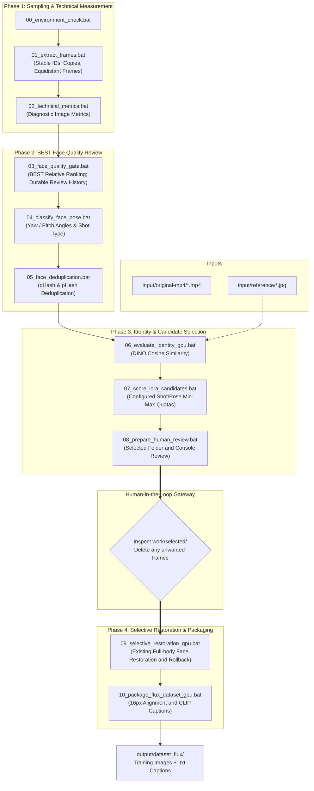

> Agent entry: before changes read [AGENTS.md](AGENTS.md), the canonical
> [.agents/AGENTS.md](.agents/AGENTS.md), [PROJECT.md](PROJECT.md),
> [Pipeline Rules](.agents/rules/lora_pipeline_rules.md) and
> [Data Lineage Rules](.agents/rules/data_lineage_rules.md).
> ACTIVE policy does not imply that all legacy runtime enforcement is implemented.

# Real Human LoRA Dataset Pipeline

An automated, high-precision computer vision pipeline engineered to generate **commercial-grade, photorealistic FLUX.1 LoRA training datasets** directly from real-world smartphone video footage and casual photographs.

Unlike conventional scrapers or naive upscalers that yield plastic "AI-looking" skin and face-angle lock, this pipeline enforces **strict photographic skin pore preservation**, **automated mobile beauty-filter rejection**, and **multi-objective shot composition quotas**.

---

## Current STEP5 operation — Deduplication v2 (2026-10-05)

Current STEP5: `bat/05_face_deduplication.bat` runs source-aware duplicate clustering
from authoritative STEP4 v2, keeps all rows and annotates STEP3 BEST representatives.
Inspect generated summary/pose/cluster HTML before STEP6; normal runner stops after
STEP5. Production has not been run by Codex. See
[STEP5 v2 implementation](docs/STEP5_DEDUP_V2_IMPLEMENTATION.md).

## Current STEP3 operation — BEST v2.2 (2026-10-05)

Run `bat/03_step3_best_ranking.bat` for balanced critical-quality ranking from
stored measurements. Inspect summary before `bat/03_best_review_round.bat 1`.
v1/v2/v2.1 reviews remain historical and do not affect scoring/shown exclusions.
ROI truth and visual haze remain unresolved. No new absolute thresholds.
Codex performed only minimum/small-sample validation. See
[implementation](docs/STEP3_BEST_RANKING_V22_IMPLEMENTATION.md).

## Historical STEP3 operation — BEST v2.1 (2026-10-05)

Run standalone `bat/03_step3_best_ranking.bat` to rescore stored measurements using
common positive-quality normalization plus a small relative bonus and measured
defect evidence. It stops without extracting a review round. Inspect the ranking
summary and top-source distribution first, then explicitly run
`bat/03_best_review_round.bat 1` to start best_rank_v2.1 / Round1 (45 candidates,
at least10 supplemental stills if available). Only current-version shown history
excludes later rounds. v1/v2 decisions remain historical evidence and may reappear.
See [v2.1 implementation and unresolved calibration](docs/STEP3_BEST_RANKING_V21_IMPLEMENTATION.md).
Review extraction from an older ranking version is blocked. Production v2.1 has NOT been run by Codex.

[Formula, operation and validation](docs/STEP3_BEST_RANKING_V2_IMPLEMENTATION.md)
and [DEC-0019](knowledge/decisions/DEC-0019-general-eye-quality-best-v21.md).
The legacy STEP4+ report integration remains deferred; run STEP3 standalone.

## Architecture & Pipeline Flow

STEP4 v2 now reads stored BEST v2.2 pose/geometry without inference or selection.
Run `bat/04_classify_face_pose.bat`, then share `docs/STEP4_POSE_COMPOSITION_SUMMARY.md`
with Chappy. Face-scale area labels do not prove body visibility. Missing/fatal
rows remain in the audit. `run_all.bat` stops after STEP4; STEP5 integration with
the new table is deferred. [Implementation and limits](docs/STEP4_POSE_COMPOSITION_IMPLEMENTATION.md).



---

## Key Features & Core Innovations

1. **Anti-Beauty-Filter & Plastic Skin Rejection (`DEC-0003`)**  
   Mobile video clips from TikTok/Instagram apply heavy bilateral smoothing and edge over-sharpening. Step 03 implements a **Dual-Bandpass Plasticity Metric** ($R = \frac{\text{EdgeSharpness}}{\text{SkinTexture}}$) that automatically detects and eliminates doll-like, plastic skin (20.8% rejection rate on benchmark datasets).
2. **Selective Restoration Policy (`DEC-0004`)**
   The policy restricts restoration to eyes/lips. Current code instead restores full face crops in eligible full-body images with Gaussian blending and identity/fidelity rollback. STEP 0 preserves this implementation; component masking is deferred to STEP9.
3. **Composition Diversity (`DEC-0005`)**
   The historical policy describes 40/40/20. Current Step7 enforces configured fixed shot/pose minimum and maximum counts, while Step8 displays separate composition targets. See Configuration below; no quota redesign was performed in STEP 0.
4. **Permanent Development Memory System**  
   Every design decision, failure, edge case, and benchmark is formally recorded with evidence in [`knowledge/`](knowledge/README.md) and [`experiments/`](experiments/README.md).

---

## Quickstart Guide

### 1. Prerequisites
- **OS**: Windows 10/11 (64-bit)
- **Python**: 3.10.x recommended (highest MediaPipe & PyTorch compatibility)
- **FFmpeg**: Installed and accessible in system `PATH`
- **GPU**: NVIDIA GPU with CUDA 12.x or 11.8 (optional but recommended for Steps 06, 09, 10)

### 2. Installation
```powershell
# Clone this repository
git clone <repository-url>
cd project_human_lora

# Install CPU baseline requirements
pip install -r requirements.txt

# (Optional for GPU steps) Install PyTorch with CUDA & GPU packages
pip install torch torchvision --index-url https://download.pytorch.org/whl/cu121
pip install -r requirements-gpu.txt
```

### 3. Setup Configuration
Copy `config/config.example.yaml` to `config/config.yaml`:
```powershell
cp config/config.example.yaml config/config.yaml
```
Open `config.yaml` and set your `target_person_name` and `trigger_word` (e.g. `ohwx woman`).

### 4. Place Source Media
- Place source videos (`.mp4`, `.mov`, etc.) in: `input/original-mp4/`
- Place 3–10 clean reference photos of the subject in: `input/reference/`

### 5. Run the Pipeline

#### Automated Full Run:
```cmd
bat\run_all.bat
```
*Note: `run_all.bat` automatically stops after Step 08, prompting you to inspect `work\selected\` and delete any unwanted frames before continuing to restoration and packaging.*

#### Standalone Step-by-Step Execution:
Every step is independently runnable:
```cmd
bat\00_environment_check.bat        :: Pre-flight environment auditor
bat\01_extract_frames.bat           :: Normalize copies and extract duration-aware frames
bat\02_technical_metrics.bat        :: Technical measurement and STEP1 completeness checks
bat\03_face_quality_gate.bat        :: Local sharpness & beauty filter rejection
bat\04_classify_face_pose.bat       :: Head angles & composition classification
bat\05_face_deduplication.bat       :: Deduplication hashing
bat\06_evaluate_identity_gpu.bat    :: [GPU] DINO similarity matching
bat\07_score_lora_candidates.bat    :: Configured quota selection into work/candidates/
bat\08_prepare_human_review.bat     :: Prepare work/selected/ and console review (HTML planned)
bat\09_selective_restoration_gpu.bat:: [GPU] Existing full-body face restoration with rollback
bat\10_package_flux_dataset_gpu.bat :: [GPU] 16px dimension alignment and CLIP captioning
```

---

## Development Memory & AI Agent Guidelines

This repository follows a strict **Development Memory Protocol** to ensure that developers and AI coding assistants do not repeat past engineering mistakes:

- **AI Agent Directives**: [`AGENTS.md`](AGENTS.md)
- **Inviolable Project Rules**: [`.agents/rules/lora_pipeline_rules.md`](.agents/rules/lora_pipeline_rules.md)
- **Active Policies**: [`knowledge/current/`](knowledge/current/README.md)
- **Architectural Decisions**: [`knowledge/decisions/`](knowledge/decisions/README.md)
- **Past Failures & Anti-Patterns**: [`knowledge/failures/`](knowledge/failures/README.md)
- **Counterexamples & Edge Cases**: [`knowledge/cases/`](knowledge/cases/README.md)
- **Validation History & Chronicles**: [`history/`](history/README.md)
- **Empirical Experiments**: [`experiments/`](experiments/README.md)
- **Benchmark Baseline**: [`docs/VALIDATED_BASELINE.md`](docs/VALIDATED_BASELINE.md)

---

## License
MIT License. Open for research and commercial LoRA fine-tuning workflows.

## Configuration

`config/config.yaml` is the pipeline Single Source of Truth for configurable runtime settings. Copy `config/config.example.yaml` to `config/config.yaml`; personal paths/settings are ignored by Git.

Priority: **explicit CLI override > local YAML > internal fallback**. When the local file is absent, the example YAML is loaded. A partial local file does not merge the example: omitted keys retain the script fallback, including legacy directory discovery. Malformed YAML, unknown keys, and schema-invalid values fail before processing. Older example keys (e.g. `target_total_images`, `yaw_bins`, `similarity_threshold`, `selective_masking`, `target_resolutions`) were never wired to the actual code; migrate using the new example instead of carrying these fields over.

Each standalone step accepts `--config path/to/file.yaml`. Existing flags such as `--target-count 10` still override configuration. Relative config and CLI paths resolve against the project root, with directory traversal outside it rejected. Explicit absolute paths (including Windows paths) are supported for local source media. `@reports/` and `@candidates/` resolve through `paths.reports_dir` and `paths.candidates_dir`.

Default values from config reflect existing code:

| Setting | Runtime default |
| --- | --- |
| Step1 extraction | 2 FPS; max 120/video across full duration; policy version 2; default trims 0 |
| Step2 blur | Computes Laplacian/Tenengrad percentiles; no independent threshold filter |
| Step3 gate | Global Laplacian 25; face Laplacian 50; eye sharpness 1.6; plasticity maximum 45 |
| Step4 pose | Yaw 15/42 degrees; pitch +/-20; extreme pitch/roll 35 |
| Step5 dedup | pHash 10; angle 12; frame-index window 6 |
| Step6 identity | DINO `facebook/dino-vitb16`; dynamic shot/pose thresholds; device auto |
| Step7 candidate pool | 65; fixed min/max quotas; output `work/candidates/` |
| Step8 initial review | 45; displayed targets 18/62/20; manually curated final guidance 30–45 |
| Step9 restoration | Fidelity 0.8; identity floor 0.6; maximum loss 0.08; minimum fidelity 0.82 |
| Step10 packaging | Trigger `character`; CLIP attributes; dimensions aligned to 16, no aspect buckets |

The final count is human-curated, not forcibly reduced to the former example's 30. Scoring formulas, image-processing kernels, landmark geometry and caption sentence templates remain algorithm code; they are not newly tunable settings. Fixed schema enum fields identify the implemented backend/method/strategy and dimension alignment, rather than promising unimplemented alternatives.

Run `py -3.10 -m unittest discover -s tests -v` for lightweight validation. Step00 checks YAML/schema, dependencies, FFmpeg, directories, and reference decoding without loading face recognition models. Empty references remain a warning to preserve earlier-step execution; Step6 needs confirmed reference images.

See [configuration knowledge](knowledge/current/configuration.md), [DEC-0006](knowledge/decisions/DEC-0006-config-single-source-of-truth.md), and [STEP 0 history](history/HIST-006_CONFIG_SSOT.md). Historical baseline results in `docs/VALIDATED_BASELINE.md` are unchanged and are not a post-migration inference claim.

## STEP 1: Video Organization and Frame Extraction

Set `project.subject_name` in private `config/config.yaml` (template default: `subject`).
STEP1 retains downloaded input videos and creates normalized standalone working
copies using `{subject_name}_v{index:02d}.{extension}`. For the generic template,
examples are `subject_v01.mp4`, `subject_v71.mp4`, and `subject_v100.mp4`.
Existing extensions are retained, not transcoded into MP4.

- Input: `paths.input_video_dir` (downloaded videos)
- Working videos: `paths.normalized_video_dir` (default `work/videos/subject_v01.mp4`)
- Frame output: `paths.raw_frames_dir` (default `work/frames_raw/subject_v01/subject_v01_001.png`)
- Mapping: `paths.manifests_dir/video_manifest.csv` (default `work/manifests/video_manifest.csv`)
- Per-video extraction: `video_extraction.csv`
- Machine summary: `step1_summary.json`

PNG filename grammar is preserved for downstream scene/frame parsing. A durable
manifest traces original filenames to normalized video IDs and hashes. First-run
assignments use case-insensitive natural filename sorting; later runs reuse all
mappings and append new files after the largest existing index. Already-normalized
IDs are reserved. An existing unrelated destination, changed source or corrupt
working copy is an error, never silently replaced or renumbered.

```cmd
bat\01_extract_frames.bat --dry-run
bat\01_extract_frames.bat --normalize-only
bat\01_extract_frames.bat
```

The standalone BAT performs normalization, manifest generation and extraction;
`run_all.bat` continues to call this BAT. Explicit CLI flags, including
`--subject-name`, `--normalized-dir`, `--manifest-dir`, `--input`, `--output`,
`--sample-fps`, `--max-frames-per-video`, `--policy-version` and `--config`, override config. `--dry-run` writes nothing.
`--normalize-only` creates copies, mappings and folders without extraction.
`--flat` is rejected because STEP1 requires per-video directories.

Frame extraction is duration-aware. Default sampling is **2 FPS**, maximum
**120 frames/video**, policy version **2**, from frame_extraction config. Short
videos produce fewer frames. Long videos are uniformly sampled across the full
duration using effective FPS=min(sample_fps,max_frames/duration). Default trims
are zero; optional step1_extract trims select a smaller validated usable interval.
There is no artificial minimum, fixed 50-frame mode or silent duration fallback.
FFprobe errors identify the video and fail the run after other videos are processed.

FFmpeg uses its fps filter (round=up), keeping PNG/native size/pixel format and
-q:v 2. The nominal count is the capped ceil(duration*sample_fps); actual count can
be one fewer at the video/container end. Actual validated counts are authoritative.
Metadata records duration, requested/effective FPS, cap, version and frame hashes.
Only matching policy/source/file hashes can be reused. Otherwise new frames are
staged and verified before preserving old folders under a sibling *_previous root.
--overwrite also archives old data. Failed staging remains outside raw image input.
Standalone STEP1 reports count min/median/max/total and fewest/most videos.

Sampling changes invalidate old STEP2 measurements. Preserve them as historical
outputs, then run STEP2 separately on STEP1 actual frame counts. No fixed total
or per-video count is assumed. See [STEP1_RESULT](docs/STEP1_RESULT.md) and
[DEC-0009](knowledge/decisions/DEC-0009-duration-aware-frame-extraction.md).

## STEP2 Technical Image Metrics

Run `bat\02_technical_metrics.bat` independently; `run_all.bat` continues to call
that BAT. Input comes from `paths.raw_frames_dir`; `paths.manifests_dir` supplies
STEP1 IDs and extraction counts. Both formal STEP1 CSVs must exist and agree.

Outputs: `step2_blur.report` (default from config: `@reports/step2_dataset_report.csv`),
plus `step2_summary.json` and `step2_diagnostic_outliers.csv` beside the effective
CSV. Optional `step2_blur.summary`/`outliers` or explicit `--summary`/`--outliers`
change those paths. `--input`, `--report`, `--manifest-dir`, `--config` use the common
CLI > config > fallback resolution. No mathematical kernels became configuration.

CSV keeps all legacy fields, including input-relative filename and relative ranks;
adds video_id, input-relative frame_id, frame_name, relative_path, short_edge,
long_edge, pixel_count, aspect_ratio, global_laplacian, global_tenengrad,
mean_brightness and processing_status. Aliases equal their legacy metric columns.
OpenCV color decode/BGR2GRAY, CV_64F Laplacian variance, mean squared 3x3 Sobel
and gray mean retain existing definitions and 3-decimal rounding.

Before scoring, STEP2 checks total/per-video counts against both STEP1 CSVs and
step1_summary.json, then verifies filenames, sizes and SHA256 against per-video
.extraction_metadata.json. A mismatch stops before scoring. The manifest lock is
shared with STEP1 and the generation is rechecked before publication.
Every current image yields one row, including decode failures. Active CSV always
contains exactly the current generation; stale rows never carry forward.
retain_missing_records=true / --retain-missing-records are prohibited; false is a
compatibility setting. Previous successful outputs are archived in step2_run_audit.
Failed measurements retain CSV/error rows, JSON and outliers in a failed_ audit
folder, return nonzero and preserve the active successful set.
Artifacts are staged and individually atomically replaced, with rollback on ordinary
publication errors. Abrupt process/power loss between replacements is not a multi-file
transaction; compare generation/counts and rerun before downstream use.

CSV records temporal_index and policy/FPS copied from official STEP1 metadata.
laplacian_percentile, tenengrad_percentile and quality_rank are global comparisons.
Matching _video columns compare only frames in the same video using the same
unique-value percentile formula. Singleton/all-equal groups receive percentile 100.
Rank orders the descending sum of percentiles; natural filename ties are deterministic.
Neither ranking selects frames. mtime is unused; there is no metric cache.
No STEP2 min_blur_score is configured: blur flag count is null with an explanation.
No threshold is invented or borrowed from STEP3.

The JSON records per-video counts and min/p25/median/p75/max distributions;
short-edge buckets <720, 720–1079, >=1080 are descriptive, not rejection gates.
Outliers list top/bottom 20 Laplacian, darkest/brightest 20 and smallest pixel-count
20 with relative identities. Legacy quality_rank is diagnostic only. Background,
hair/clothing and compression/pixelation can produce high gradients despite soft
faces. No face, pose, identity or LoRA suitability decision is made in STEP2.
Failures continue through all images and cause a nonzero final exit. See
[STEP2_RESULT](docs/STEP2_RESULT.md), [current policy](knowledge/current/technical-image-metrics.md)
and [DEC-0010](knowledge/decisions/DEC-0010-current-generation-technical-reports.md).

### STEP2 human evaluation report layer

After successful measurement, run from the project root:

```powershell
py -3.10 scripts/build_step2_reports.py
```

This command reads the existing CSV and metadata only; it does not decode images,
recalculate image metrics or modify any frame rank/Gate. It uses the common config
loader (CLI > local config > fallback) and the configured step2_blur.report.

| File | Role |
| --- | --- |
| output/reports/step2_dataset_report.csv | Unchanged machine-readable raw metrics for every frame |
| output/reports/step2_video_summary.csv | One aggregate row per video, distribution and global-tail counts |
| output/reports/step2_distribution_summary.csv | One row per metric; P01..P99, mean and population std |
| output/reports/step2_summary.json | Unchanged measurement-generation metadata and completeness |
| docs/STEP2_METRICS_SUMMARY.md | Human dataset/video/frame overview, percentile/exposure tails and examples |

Default derived CSVs sit beside the effective source CSV. Override paths with
--dataset-report, --summary (source measurement JSON), --manifest-dir,
--video-summary, --distribution-summary and --markdown. No new dependencies.
Generation validation requires successful unique CSV rows, complete saved global
ranks, matching STEP2 summary and STEP1 total/per-video counts/policy/traceability.
No frame image is opened during report aggregation. Outputs are staged and atomically
replaced per file; ordinary replacement failures roll back the preceding good set.
Process/power loss across files is not transactional; rerun aggregation if interrupted.

Aggregates use linear percentile interpolation of stored CSV values, population
std (ddof=0), and 6-decimal output. Diagnostic video technical median percentile
is the average of the Laplacian and Tenengrad median percentiles across videos.
Each median percentile indexes sorted unique video medians from 0..100 (singleton /
all-equal = 100). Descending median/technical ranks use natural video_id ties.
These video ranks are new human diagnostics and do not overwrite existing frame ranks.

Global tail counts use the existing quality_rank (1 = highest): top/bottom p%
contains ceil(N*p/100) frames. 1/5/10/25% counts are cumulative and overlap.
Middle Markdown bands divide at ceil(N*25/50/75%), excluding the two 10% tails.
Exposure tails use dataset percentiles inclusively; ties can increase counts above
the nominal percentage. Laplacian histogram bins are descriptive intervals, never
rejection thresholds. Inspect distributions and video concentration before looking
at individual examples. Facial-region quality and identity need later evaluation;
these reports do not select frames or establish new Gates.


## STEP3 Revision1 — Full Face Audit

Current-generation STEP3 keeps every STEP2 row/value, including no-face, multiple-face,
rejected and error frames. step3_step_name adds STEP identity without overwriting STEP2.
Formal STEP1/2 metadata and raw inventory/content hashes are checked before/after inference.
No Gate value/kernel was tuned. Whole-frame quality ranks and provisional face-scale classes
are distinct from face eligibility and STEP4 composition. Blink/mouth geometry is diagnostic only.

Install an isolated runtime without replacing global STEP2 packages:

```powershell
py -3.10 -m pip install --target .step3_packages -r requirements-step3.txt
bat\03_face_quality_gate.bat
```

The STEP3 BAT prepends .step3_packages only for its own invocation. Raw frames are immutable.
`--limit 10` writes a separate .partial.csv/audit set. Analysis errors preserve audit rows,
return nonzero and do not replace good reports. Staged publication has ordinary-error rollback;
multi-file replacement is not an OS-crash transaction.

Outputs: step3_dataset_report.csv, step3_summary.json, video/reason/distribution CSVs and
[human summary](docs/STEP3_FACE_QUALITY_SUMMARY.md). Reasons overlap; primary categories
are exclusive. Missing anatomy differs from measurement/disabled-eye status. Optional
`--copy-review` creates copies/crops outside input, grouped by report hash; --review/--crops
set their roots and --overwrite controls existing copies. Default production emits reports.
Legacy review folders never override CSV truth.

CSV-only regeneration, without MediaPipe/inference/image decoding:

```powershell
py -3.10 scripts/build_step3_reports.py
```

Observed current run: 2001 rows, errors0, eligible62/reject1939; all36 STEP2 fields retained.
94 tests PASS; full-production/report replay and original Gate regression verified.
This establishes audit execution, not scientific filter/occlusion accuracy or training suitability.
See [result](docs/STEP3_RESULT.md), [existing Gate audit](docs/STEP3_GATE_AUDIT.md),
[experiment](experiments/EXP-20261002-005-step3-full-audit.md).


## STEP3 Revision2 — Calibration Review (Historical / Superseded)

Production Gates and the authoritative STEP3 CSV stay unchanged. Generate derived
contributions, threshold positions, reason combinations, per-frame blur/eye-state
analysis, counterfactuals, eligibility concentration and stratified review material:

```powershell
py -3.10 scripts/build_step3_calibration.py --target 180 --video-cap 5
```

[Historical offline review](docs/STEP3_CALIBRATION_REVIEW_SUPERSEDED_fe12ba72980e02d4.html) in a local browser. Compare
full frame/plain face crop, choose labels or UNSURE, add notes, and export JSON/CSV.
Labels start empty and remain browser-local until export; no Gate/CSV auto-update.
Keep exported labels for the next review stage. Existing labeled calibration CSVs
are protected from regeneration. No server/external requests. The agent's browser
file:// policy blocks visual UI QA; static JS/export and image-reference tests passed.

180 frames/71 videos, max4/video under cap5;59 available boundary strata covered.
109 tests PASS. [Result](docs/STEP3_CALIBRATION_RESULT.md) and
[historical/formula audit](docs/STEP3_GATE_CALIBRATION_AUDIT.md).
Status: CALIBRATION_READY / AWAITING HUMAN LABELS. Gate tuning and STEP4: NOT READY.


## STEP3 REJECT Boundary Review — Historical45-frame set

The historical180-frame generator refuses to replace the active boundary review.
Generate the active REJECT-only review with:

```powershell
py -3.10 scripts/build_step3_boundary_review.py --target 45 --video-cap 3
```

[Open boundary review](docs/STEP3_CALIBRATION_REVIEW.html):45 unique REJECT images
from45 videos; Eligible0. Only relevant boundary Gates are questioned, with
ACCEPT/REJECT/UNSURE and optional notes per Gate. Cards show values, actual run
thresholds, diagnostics and executed rejection use. Export JSON or Gate-specific
long-format CSV;81 independent Gate label rows. Keep portable exports when finished.
Labels are not applied to production decisions. The original180-frame CSV/assets/UI
and browser label namespace remain historical; old answers are not reinterpreted.

114 tests and new/historical synthetic DOM exports pass; source hashes and all45
copy/crop assets verified. Browser file-access policy prevents agent visual UI QA.
[Boundary result](docs/STEP3_BOUNDARY_CALIBRATION_RESULT.md).
Status: READY_FOR_HUMAN_BOUNDARY_REVIEW. Threshold tuning/STEP4 remain pending.


## Active Single-Gate Boundary Review

`py -3.10 scripts/build_step3_boundary_review.py --target 45 --video-cap 3`
now treats target as a maximum and never fills missing categories. Active review:
25 unique REJECT frames/17 videos; one failing near-threshold target per frame,
all other applicable hard gates PASS. Eligible0; multi-failure0. One Gate question
per image, same offline JSON/CSV export. Previous45/180 sets remain debug history.
[Review](docs/STEP3_CALIBRATION_REVIEW.html).
[Scoped result](docs/STEP3_SINGLE_GATE_BOUNDARY_FIX.md).117 tests PASS.
Production CSV, thresholds, formulas, source images and STEP4+ unchanged.

### STEP7 Revision B candidate selection

`bat\07_score_lora_candidates.bat` now runs the report-only Revision B path.
Use current-generation STEP3, full A/B/C sidecar, STEP4 and STEP5 outputs; STEP6
identity safety is consumed when available. Settings live in `step7_revision_b`.
A is primary, confirmed B fills shortages, pending B stays a review reserve, and
C is excluded. The configured target is 40 within 35–45. Four selection reports
retain the complete audit plus selected/reserve subsets. No images are copied.
`run_all.bat` stops after STEP7 to prevent legacy STEP8 consuming old candidate
folders. See [Revision B setup, outputs and limits](docs/STEP7_REVISION_B_RESULT.md).

### STEP3 Revision A diagnostics only

Current scope correction: ALL formal frames + supplemental stills (currently2,058), not the earlier138-row subset. Execution belongs to maru; corrected pipeline is not yet run. See [Maru full-input execution instructions](docs/STEP3_REVISION_A_MARU_RUN.md).

Run `bat\03_revision_a_diagnostics.bat` after declaring `supplemental_dir` in private `config/step3_revision_a.local.json` copied from the example. Outputs are separate immutable diagnostic runs; official STEP3 Gates and labels are unchanged. A/B/C selection is distinct: provisional B/UNDECIDED needs human confirmation before reserve use. See [Revision A result and setup](docs/STEP3_REVISION_A_RESULT.md). This does not perform final selection.


## STEP3 canonical192 architecture update

[Implementation result](docs/STEP3_CANONICAL192_IMPLEMENTATION.md): canonical face-core Laplacian is the approved sharpness Hard Gate. Native blur, eye/skin/beauty/plasticity are diagnostics; other retained Hard Gates remain unchanged. Earlier beauty-rejection and native-threshold descriptions are historical. Full production rerun is pending maru; existing reports have not been regenerated. Normal entry point remains bat/03_face_quality_gate.bat.

## Current STEP3 review outputs

[STEP3 review revision](docs/STEP3_REVIEW_GAPS_IMPLEMENTATION.md) keeps canonical192 sharpness and retained Hard Gates. Half-eye/exposure are diagnostic-only; a large measurable FULL_BODY face undergoes the existing per-eye presence validation. A complete successful 03_face_quality_gate.bat refreshes disposable configured reports/passed and reports/borderline copies. They are never inputs/lineage or A/B/C decisions and may be deleted after review. Failed/partial runs retain the previous successful copies. Production rerun belongs to ★maru; wait for Chappy review before Revision A.
