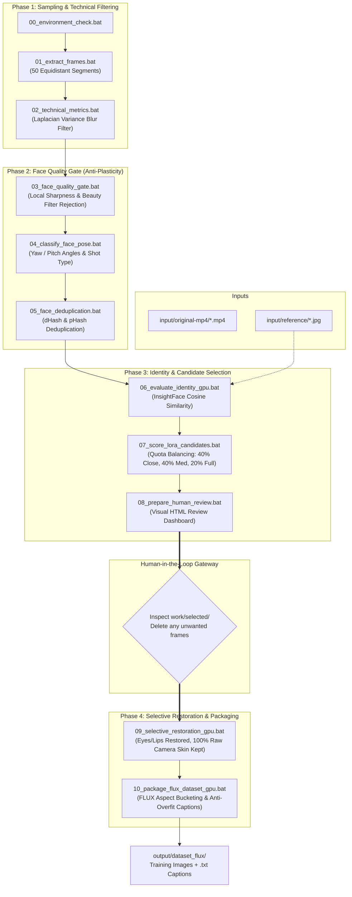

# Real Human LoRA Dataset Pipeline

An automated, high-precision computer vision pipeline engineered to generate **commercial-grade, photorealistic FLUX.1 LoRA training datasets** directly from real-world smartphone video footage and casual photographs.

Unlike conventional scrapers or naive upscalers that yield plastic "AI-looking" skin and face-angle lock, this pipeline enforces **strict photographic skin pore preservation**, **automated mobile beauty-filter rejection**, and **multi-objective shot composition quotas**.

---

## Architecture & Pipeline Flow



---

## Key Features & Core Innovations

1. **Anti-Beauty-Filter & Plastic Skin Rejection (`DEC-0003`)**  
   Mobile video clips from TikTok/Instagram apply heavy bilateral smoothing and edge over-sharpening. Step 03 implements a **Dual-Bandpass Plasticity Metric** ($R = \frac{\text{EdgeSharpness}}{\text{SkinTexture}}$) that automatically detects and eliminates doll-like, plastic skin (20.8% rejection rate on benchmark datasets).
2. **Selective Component Neural Restoration (`DEC-0004`)**  
   Step 09 restores fine anatomical facial features (eyes, iris reflections, eyelashes, eyebrows, lips) while **preserving 100% untouched camera sensor noise, pores, and fine skin grain** across the cheeks, nose, and forehead. Whole-face AI upscaling is strictly prohibited (`FAIL-0001`).
3. **Multi-Objective Composition Quotas (`DEC-0005`)**  
   Eliminates "frontal angle lock" and "close-up bias" by enforcing an exact dataset distribution:
   - **Close-up Shots**: 40%
   - **Medium Shots (Upper Body)**: 40%
   - **Full Body / Wide Environmental**: 20%
   - **Head Pose Range**: Multi-angle distribution (Frontal, Half-Profile, Profile).
4. **Permanent Development Memory System**  
   Every design decision, failure, edge case, and benchmark is formally recorded with evidence in [`knowledge/`](file:///./knowledge/README.md) and [`experiments/`](file:///./experiments/README.md).

---

## Quickstart Guide

### 1. Prerequisites
- **OS**: Windows 10/11 (64-bit)
- **Python**: 3.10.x recommended (highest MediaPipe & PyTorch compatibility)
- **FFmpeg**: Installed and accessible in system `PATH`
- **GPU**: NVIDIA GPU with CUDA 12.x or 11.8 (optional but recommended for Steps 06, 09, 10)

### 2. Installation
```powershell
# Clone this repository
git clone <repository-url>
cd project_human_lora

# Install CPU baseline requirements
pip install -r requirements.txt

# (Optional for GPU steps) Install PyTorch with CUDA & GPU packages
pip install torch torchvision --index-url https://download.pytorch.org/whl/cu121
pip install -r requirements-gpu.txt
```

### 3. Setup Configuration
Copy `config/config.example.yaml` to `config/config.yaml`:
```powershell
cp config/config.example.yaml config/config.yaml
```
Open `config.yaml` and set your `target_person_name` and `trigger_word` (e.g. `ohwx woman`).

### 4. Place Source Media
- Place source videos (`.mp4`, `.mov`, etc.) in: `input/original-mp4/`
- Place 3–10 clean reference photos of the subject in: `input/reference/`

### 5. Run the Pipeline

#### Automated Full Run:
```cmd
bat\run_all.bat
```
*Note: `run_all.bat` automatically stops after Step 08, prompting you to inspect `work\selected\` and delete any unwanted frames before continuing to restoration and packaging.*

#### Standalone Step-by-Step Execution:
Every step is independently runnable:
```cmd
bat\00_environment_check.bat        :: Pre-flight environment auditor
bat\01_extract_frames.bat           :: Extract 50 equidistant frames per video
bat\02_technical_metrics.bat        :: Global blur scoring
bat\03_face_quality_gate.bat        :: Local sharpness & beauty filter rejection
bat\04_classify_face_pose.bat       :: Head angles & composition classification
bat\05_face_deduplication.bat       :: Deduplication hashing
bat\06_evaluate_identity_gpu.bat    :: [GPU] InsightFace similarity matching
bat\07_score_lora_candidates.bat    :: Quota balancing & candidate selection (30 images)
bat\08_prepare_human_review.bat     :: Generate HTML review dashboard
bat\09_selective_restoration_gpu.bat:: [GPU] Masked restoration (100% raw skin preserved)
bat\10_package_flux_dataset_gpu.bat :: [GPU] FLUX aspect bucketing & captioning
```

---

## Development Memory & AI Agent Guidelines

This repository follows a strict **Development Memory Protocol** to ensure that developers and AI coding assistants do not repeat past engineering mistakes:

- **AI Agent Directives**: [`.agents/AGENTS.md`](file:///./.agents/AGENTS.md)
- **Inviolable Project Rules**: [`.agents/rules/lora_pipeline_rules.md`](file:///./.agents/rules/lora_pipeline_rules.md)
- **Active Policies**: [`knowledge/current/`](file:///./knowledge/current/README.md)
- **Architectural Decisions**: [`knowledge/decisions/`](file:///./knowledge/decisions/README.md)
- **Past Failures & Anti-Patterns**: [`knowledge/failures/`](file:///./knowledge/failures/README.md)
- **Counterexamples & Edge Cases**: [`knowledge/cases/`](file:///./knowledge/cases/README.md)
- **Validation History & Chronicles**: [`history/`](file:///./history/README.md)
- **Empirical Experiments**: [`experiments/`](file:///./experiments/README.md)
- **Benchmark Baseline**: [`docs/VALIDATED_BASELINE.md`](file:///./docs/VALIDATED_BASELINE.md)

---

## License
MIT License. Open for research and commercial LoRA fine-tuning workflows.
